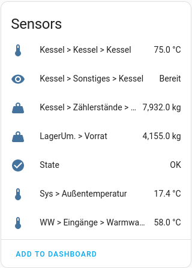
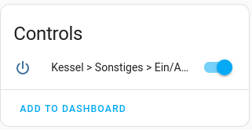
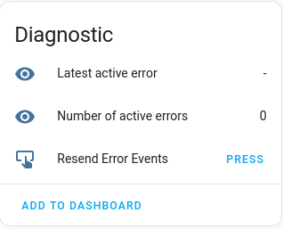
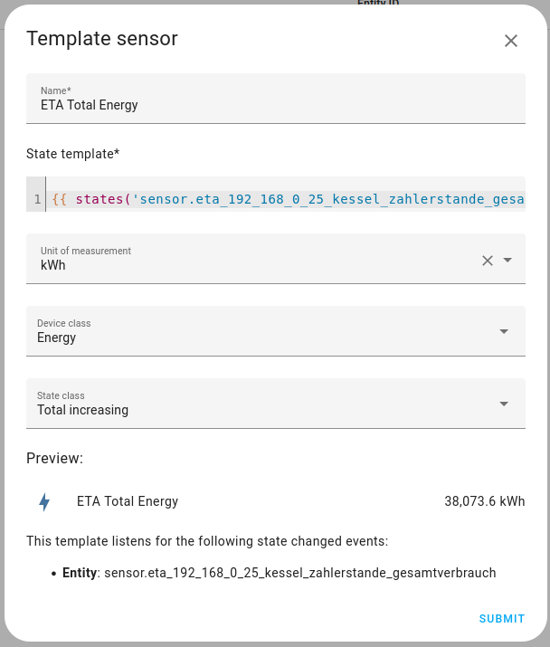

[](https://github.com/custom-components/hacs)

# ETA Integration for Home Assistant

Integration of ETA (Heating) sensors and switches to Home Assistant

This integration uses the [ETA REST API](https://www.meineta.at/javax.faces.resource/downloads/ETA-RESTful-v1.2.pdf.xhtml?ln=default&v=0) to get sensor values and set switch states from the ETA pellets heating unit.

This is a fork of [nigl's repo](https://github.com/nigl/homeassistant_eta_integration) with the following changes:

-   Friendly sensor names
-   Shows the current values for all sensors during configuration
    -   This makes it way easier to select the relevant sensors
-   Implemented Switches
-   Implemented Text Sensors (state of some endpoints, e.g. `Bereit` (`Ready`) or `Heizen` (`Heating`) for the boiler)
-   Implemented error sensors:
    -   A binary sensor, which activates if the ETA terminal reports at least one error
    -   A sensor, which shows the number of active errors
    -   A sensor, which shows the latest active error message
-   Implemented error events ([details](#error-events))
-   Implemented a custom service to set the value of an endpoint ([details](#set-value-service))
-   Implemented writable sensors ([details](#writable-sensors))

## Screenshots

|            Sensors             |             Controls             |              Diagnostic              |
| :----------------------------: | :------------------------------: | :----------------------------------: |
|  |  |  |

## Installation

This integration can be configured directly in Home Assistant via HACS:

1. Go to `HACS` -> `Integrations` -> Click on the three dots in the top right corner --> Click on `Userdefined repositories`
1. Insert `https://github.com/Tidone/homeassistant_eta_integration` into the field `Repository`
1. Choose `Integration` in the dropdown field `Category`.
1. Click on the `Add` button.
1. Then search for the new added `ETA` integration, click on it and the click on the button `Download` on the bottom right corner
1. Restart Home Assistant when it says to.
1. In Home Assistant, go to `Configuration` -> `Integrations` -> Click `+ Add Integration`
   Search for `Eta Sensors` and follow the instructions.
    - **Note**: After entering the host and port the integration will query information about every possible endpoint. This step can take a very long time, so please have some patience.
    - **Note**: This only affects the configuration step when adding the integration. After the integration has been configured, only the selected entities will be queried.
    - **Note**: The integration will also query the current sensor values of all endpoints when clicking on `Configure`. This will also take a bit of time, but not as much as when adding the integration for the first time.

## General Notes

-   You have to activate the webservices API on your pellet heater first: see the "official" [documentation](https://www.meineta.at/javax.faces.resource/downloads/ETA-RESTful-v1.2.pdf.xhtml?ln=default&v=0):

    -   Log in to `meinETA`
    -   Go to `Settings` in the middle of the page (not the bottom one!)
    -   Click on `Activate Webservices`
    -   Follow the instructions

-   For best results, your pellet heater has to support at least API version **1.2**. If you are on an older version the integration will fall back to a compatibility mode, which means that some sensors may not be correctly detected/identified. The ones that are correctly detected and identified should still work without problems.\
    If you want to update the firmware of your pellet heater you can find the firmware files on `meinETA` (`Settings at the bottom` -> `Installation & Software`).

-   Your ETA pellets unit needs a static IP address! Either configure the IP adress directly on the ETA terminal, or set the DHCP server on your router to give the ETA unit a static lease.

## Error Events

This integration publishes an event whenever a new error is reported by the ETA terminal, or when an active error is cleared.
These events can then be handled in automations.

### Event Info

If a new error is reported, an `eta_webservices_error_detected` event is published.\
If an error is cleared, an `eta_webservices_error_cleared` event is published.

Every event has the following data:
| Name | Info | Sample Data |
|------------|----------------------------------------------------|---------------------------------------------------------------------------------------------|
| `msg` | Short error message | Water pressure too low 0,00 bar |
| `priority` | Error priority | Error |
| `time` | Time of the error, as reported by the ETA terminal | 2011-06-29T12:48:12 |
| `text` | Detailed error message | Top up heating water! If this warning occurs more than once a year, please contact plumber. |
| `fub` | Functional Block of the error | Kessel |
| `host` | Address of the ETA terminal connection | 0.0.0.0 |
| `port` | Port of the ETA terminal connection | 8080 |

### Checking Event Info

If you want to check the data of an active event, you can follow these steps.

**Note**: This is only possible if the ETA terminal actually reports an ective error!

1. Open Home Assistant in two tabs
1. On the first tab go to `Settings` -> `Devices & Services` -> `Devices` on top -> `ETA`
1. On the second tab go to `Developer tools` -> `Events` on top -> Enter `eta_webservices_error_detected` in the field `Event to subscribe to` -> Click on `Start Listening`
1. On the first tab click on the `Resend Error Events` button
1. On the second tab you can now see the detailed event info

### Sending a Test Event

If you want to send a test event to check if your automations work you can follow these steps:

1. Go to `Developer tools` -> `Events` on top
1. Enter `eta_webservices_error_detected` in the field `Event type`
1. Enter your test payload in the `Event data` field
    - ```
      msg: Test
      priority: Error
      time: "2023-11-06T12:48:12"
      text: This is a test error.
      fub: Kessel
      host: 0.0.0.0
      port: 8080
      ```
1. Click on `Fire Event`
1. Your automation should have been triggered

## Writable Sensors

This implementation supports setting the value of sensors which have a unit of `°C`, `kg`, or `%`.

These writable sensors are not immediately added to the dashboard in Home Assistant. You can find the sensors (after adding them via configuration) on the ETA device page under `Config`.

### Migration

You can add writable sensors by clicking on `Configure` on the ETA Integeration page in Home Assistant.
If you are clicking this button for the first time after updating this integration from a previous version without support for these sensor types, this step will take a while because the integration will have to query the list of valid sensors from the ETA unit again.

### Caveats on APi v1.1

API v1.1 does not have some endpoints, which are used to query the valid values of writable sensors.
If your terminal is on this API version, the integration will fall back to a compatibility mode and guess the valid value ranges for these sensors.

Also, on API v1.1 it is not possible to query if a sensor is writable at all! This integration therefore shows all sensors in the list of writable sensors, and the user has to choose the ones which are actually writable.

### Legal Notes

The authors cannot be made responsible if the user renders their ETA heating unit unusable because they set a sensor to an invalid value.

## Set Value Service

This integration implements a custom service to write values to ETA endpoints.

**Attention**: This service is very low-level and does not respect the `scaleFactor` and other attributes of the endpoints! You have to calculate the correct value yourself!
E.g. If an endpoint has a scaleFactor of 10 and you want set the value 55, you have to write 550 to the endpoint.

### Testing the Service

1. Open Home Assistant
1. Go to `Developer tools` -> `Services` on top
1. Select the `Eta Sensors: Set value` service
1. Enter the numeric part of the endpoint URI (e.g. `/40/10021/0/0/12080`, which should be the On/Off button)
1. Enter the value you want to write (e.g. `1803` to turn on the heating unit)
1. Some endpoints, such as the heating windows, require a begin and end time in addition to the value
    - These values have to be specified in 15 minute increments since midnight!
        - E.g. a time of 15:30 (3:30pm) would be a value of `62` (`15*4+2` or `(15*60+30)/15`)

## Integrating the ETA Unit into the Energy Dashboard

You can add the ETA Heating Unit into the Energy Dashboard by converting the total pellets consumption into kWh, and adding that as a gas heater.

To convert the consumption you have to add a custom template sensor to your `configuration.yaml` file:

```
# Convert pellet consumption (kg) to energy consumption (kWh)
template:
  - sensor:
    - name: eta_total_energy
      unit_of_measurement: kWh
      device_class: energy
      state_class: total_increasing
      state: >
        {{ states('sensor.eta_<IP>_kessel_zahlerstande_gesamtverbrauch') | float(default=0.0) | multiply(4.8) | round(1) }}
```

Make sure to replace the `&lt;IP> field with the Ip address of your ETA unit. You can also check the sensor id by going to the options of the sensor, and

You can also use the web interface to create a template helper:


You can then add your ETA heating unit to your Energy Dashboard by adding this new sensor to the list of gas sources.

## Future Development

If you have some ideas about expansions to this implementation, please open an issue and I may look into it.
